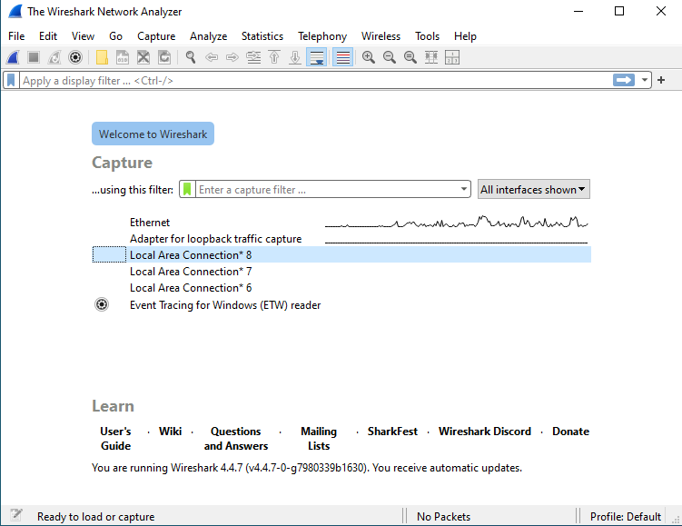
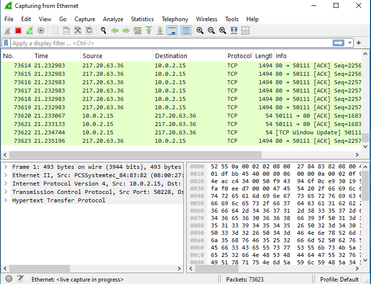
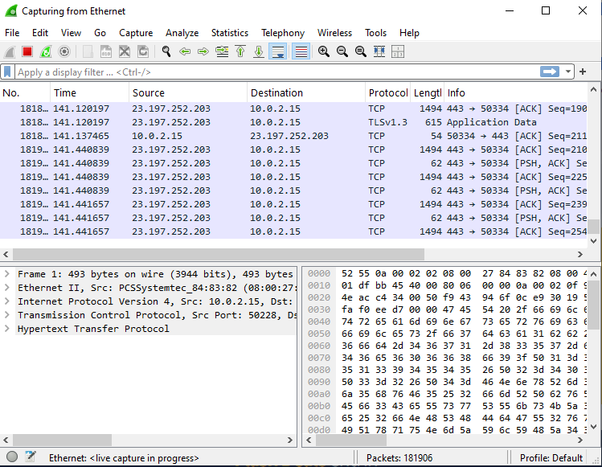
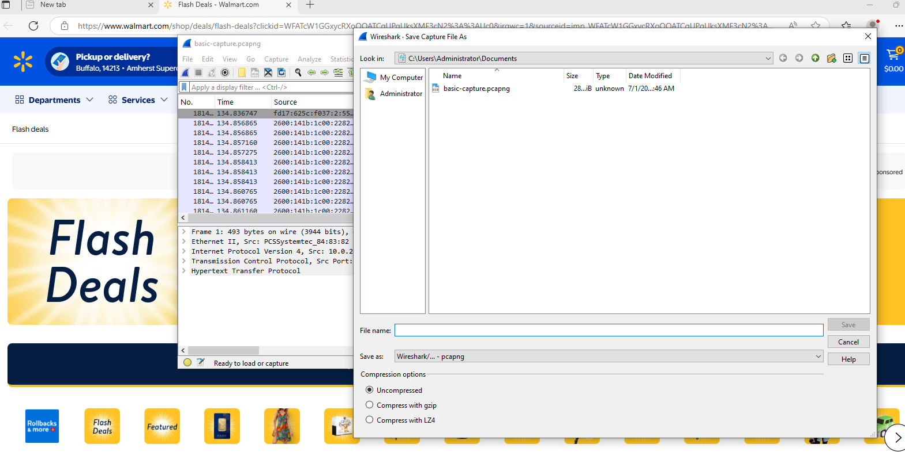
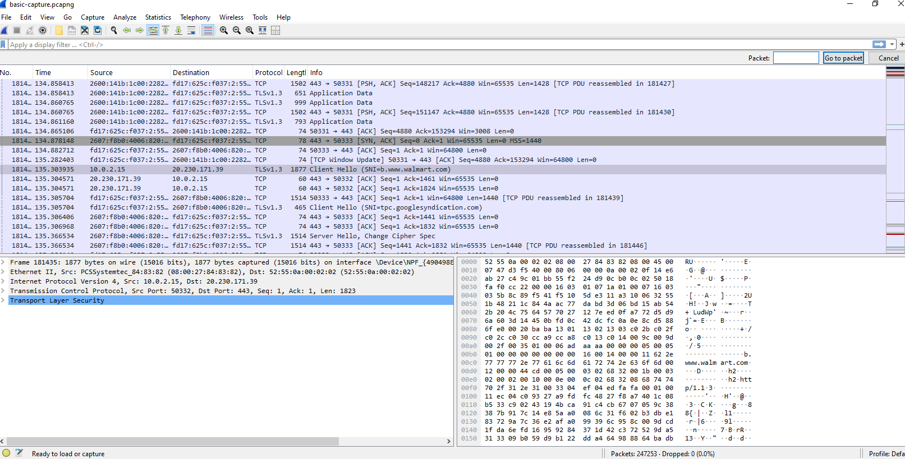

# 🧪 Basic Packet Capture Lab (Wireshark)

## 🎯 Goal
In this lab, I used Wireshark to capture and analyze live network traffic while discovering how encrypted communication works under the hood.

---

## 🧭 Step 1: Opening Wireshark

When I first opened Wireshark, I saw a list of available network interfaces (like Wi-Fi or Ethernet).

Each interface is like an ear tuned to a specific part of the network. I chose the one my system used to connect to the internet.

### 📸 Screenshot 1:

---

## 🚦 Step 2: Capturing Live Traffic

I clicked on my active network interface to begin the capture. Packets started appearing in real time — each one representing a piece of data being sent or received by my machine.

### 📸 Screenshot 2:

---

## 🌐 Step 3: Generating Web Traffic

To simulate typical network activity, I visited `https://www.walmart.com` in my browser. This created a surge of visible traffic in Wireshark.

### 📸 Screenshot 3:

---

## 🛑 Step 4: Stopping and Saving the Capture

Once I had enough data, I clicked the stop button and saved the capture as a `.pcapng` file for future analysis.

### 📸 Screenshot 4:

---

## 🧠 Step 5: Inspecting a Packet

I selected a single packet and expanded its layers: Frame, Ethernet II, IP, TCP, and TLS. This helped me understand how network communication is structured in layers.

### 📸 Screenshot 5:

---

## 🧾 Hex + ASCII View

At the bottom of Wireshark, I explored the raw contents of a packet in both hexadecimal and ASCII formats:
- Hex shows the raw byte values (like `77` = one byte)
- ASCII translates readable values (like `www.walmart.com`)

> "Each pair like `77` or `61` is one byte of data", I learned that this means each pair is a chunk of raw binary data that can be translated to readable characters using ASCII.

I also discovered that **ASCII** is pronounced **"ASK-ee"**.

---

## 🔐 Why TLSv1.3 Appears After TCP

At first, packets show up as `TCP`, but once the encryption handshake begins, they switch to `TLSv1.3`. 

TCP builds the connection, and TLS takes over to encrypt the session. This shift signals that secure communication has begun.

---

## 📍 Private vs Public IPs

I confirmed that `10.0.2.15` was my **private IP address** used only within my local network or virtual machine. 

Meanwhile, `20.230.171.39` was the **public IP address** that represented Walmart's server (or a CDN hosting their content).

---

## 📊 Packet Volume Insight

I was surprised to see over **247,000 packets captured in just 2 minutes**. This made me realize how much background traffic is constantly moving — from browser requests to system processes.

---

## ✅ Summary

In this lab, I:
- Captured live packets with Wireshark
- Generated secure web traffic
- Stopped and saved the capture for analysis
- Explored packet layers and encryption handshakes
- Decoded hex and ASCII views to reveal real content
- Interpreted IP addresses and understood protocol shifts

This gave me a hands-on look at how network traffic flows, and how encryption protects that data in real time.
